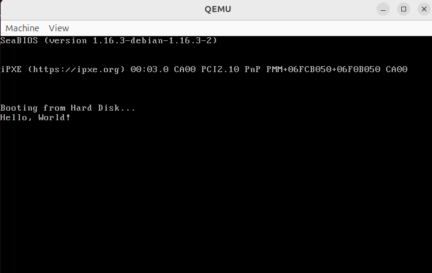
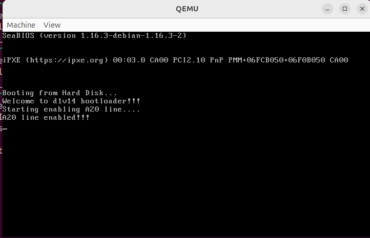

# Репа, в которую я буду лить какой-то код в потугах понять и попрактиковаться в программировании операционных систем
## Для сборки всего проекта необходимо выполнить команду:
``` sudo ./build.sh```
> После выполнения команды рядом со скриптом появится папка build, которая содержит все промежуточные файлы cmake и сам билд в папке build.
> * Все бинарныe запускаемые ELF-файлы находятся в папке build/build/bin
> * Все плоские бинарные файлы (как bios_hello_world) находятся в build/build/flat_bin
> * Все динамические библиотеки находятся в build/build/dll
> * Все статические библиотеки находятся в build/build/libс
## 1. bios_hello_world/
Начало положу ассемблерной программой, которая загружается из БИОСа и выводит Hello World примитивами BIOS.
> ### Краткая информация: 
> При включении компьютера блок питания проводит самодиагностику и посылает сигнал Power Good.<br>
> При получении синала Power Good процессор сбрасывается и начинает загружать в оперативную память программу, записанную в материнской памяти (БИОС) <br>
> БИОС в свою очередь, начинает последовательно проверять все подключенные устройства следующим образом: <br>
> 1. Вычитывает с устройства первые 512 байт и загружает их в оперативную память по адресу 0x7c00
> 2. Проверяет, что в последних двух байтах (510 и 511) записано число 0xaa55 - это число является индикатором того, что эти 512 байт являются программой - загрузчиком
> 3. Если число совпадает - начинается выполнение программы с адреса, куда она была загружена (0x7c00)

Исходный код на ассемблере со всеми комментариями  представлен в файле bios_hello_world/hello_world.asm. 

Для проверки данного bootloader необходимо запустить эмулятор БИОСа и передать ему наш плоский файл с программой-бутлоадером.
Для этого необходимо выполнить следующие комманды:
``` 
cd build/build/flat_bin
qemu-system-x86_64 boot_hello_world.bin
```
В результате выполнения следующих комманд и запуска плоского бинарного файла через BIOS получен следующий результат:


## 2. a20_line_unlocking/
Вторым шагом в разработке собственной мини ОС стало включение линии А20
> ### Краткая информация:
> При выполнении программы-бутлоадера процессор работает в 16-битном реальном режиме, поэтому все регистры 16 битные и он может обрабатывать за раз данные размером 16 бит максимум<br>
> Но шина адреса имеет больший размер (A0 - A..) и с самого начала нам доступно только 20 линий. Для того, чтобы адресовать памяти больше, чем доступно 16 разрядами используется относительная адресация.<br>
> Желаемый адрес получается смещением от сегмента данных, который хранится в регистре ds. Формула вычисления адреса: ( сегоьомент данных * 16) + смещение<br>
> Если получаемый адрес вываливается за исходные 20 линий (А0 - А19), получаемый адрес заворачивается, обнуляя все биты дальше 19. <br>
> Пример: 0x1100000000100000000011 -> 0x0000000000100000000011. Получается, что все адреса выше 1Мб возвращаются опять в начало.(0х64)
> Чтобы адресовать память с адресом больше 1 Мб необходимо включить линию А20. <br>
> Физически на микросхеме процессор соединен с контроллером клавиатуры. У данного контроллера есть два порта: управляющий порт (0х64) и порт данных (0х60) <br>
> Разработчики материнской платы встроили функционал включения линии А20 через контроллер клавиатуры, соединив ножку контроллера клавиатуры с линиями шины данных <br>
> Таким образом, подав контроллер клавиатуры команду включения линии А20, контроллер клавиатуры выставит 1 на ножку, соединенную с адресной шиной и разблокирует линии <br>
>   Пайплайн включения линии А20:
> 1. Считывать состояние контроллера клавиатуры с управляющего порта контроллера клавиатуры, пока его буфер не будет свободен.
> 2. Записать в управляюший порт клавиатуры команду о том, что мы собираемся передать команду в порт данных.
> 3. Считывать состояние контроллера клавиатуры с управляющего порта контроллера клавиатуры, пока его буфер не будет свободен для того, чтобы понять, что контроллер клавиатуры переварил команду и готов принимать данные на порте данныхзлт
> 4. Записать в порт данных команду включения линии A20
> 5. Проверить, что линия А20 включилась, записав данные по адресу свыше 1Мб и считав результат с адреса, который получился бы при завороте. Если данные разные - линия включилась.
> 6. Пример: Пишем по адресу 0x10500 и читаем с адреса 0x500. Запись в 0x10500 получим, выставив сегментный регистр в OxFFFF и записывая по адресу 0x510 (OxFFFF * 16 + 0x510 = 0xFFFF0 + 0x510 = 0x10500)

По сравнению с предыдущим бутлоадером, в этом я спрогрессировал в применении ассемблера:
* Начал писать функции на ассемблере
* Написал фунцию, в которую передается параметр через регистр
* Сделал код более говорящим 
* Сделал подробный вывод в консоль обо всех действиях, выполняемых программой 

Исходный код на ассемблере со всеми комментариями  представлен в файле a20_line_unlocking/a20_line_unlocking.asm.

Для проверки данного bootloader необходимо запустить эмулятор БИОСа и передать ему наш плоский файл с программой-бутлоадером.
Для этого необходимо выполнить следующие комманды:
``` 
cd build/build/flat_bin
qemu-system-x86_64 a20_line_unlocking.bin
```
В результате выполнения следующих комманд и запуска плоского бинарного файла через BIOS 


## 3. fast_a20_line_unlocking/
Третим шагом в разработке собственной мини ОС стало изученте быстрого способа включение линии А20
> ### Краткая информация:
> Со временем поняли, что включение линии А20 через контроллер клавиатуры - медленное решение<br>
> Поэтому на процессоре добавили отдельный порт 0х92 для управления системой. Через него появилась возможность отправлять команды перезагрузки и включать линию А20 <br>
>   Пайплайн включения линии А20:
> 1. Считать состояние с порта 0х92.
> 2. Установить второй бит в данные состояние.
> 3. Отправить состояние в порт 0х92.я
> 5. Проверить, что линия А20 включилась, записав данные по адресу свыше 1Мб и считав результат с адреса, который получился бы при завороте. Если данные разные - линия включилась.
> 6. Пример: Пишем по адресу 0x10500 и читаем с адреса 0x500. Запись в 0x10500 получим, выставив сегментный регистр в OxFFFF и записывая по адресу 0x510 (OxFFFF * 16 + 0x510 = 0xFFFF0 + 0x510 = 0x10500)

Исходный код на ассемблере со всеми комментариями  представлен в файле fast_a20_line_unlocking/fast_a20_line_unlocking.asm.

Для проверки данного bootloader необходимо запустить эмулятор БИОСа и передать ему наш плоский файл с программой-бутлоадером.
Для этого необходимо выполнить следующие комманды:
``` 
cd build/build/flat_bin
qemu-system-x86_64 fast_a20_line_unlocking.bin
```
В результате выполнения следующих комманд и запуска плоского бинарного файла через BIOS получен следующий результат:
